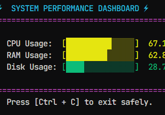

# PULSE

A fancy way of visualizing your computer's performance via the terminal cli.

## HOW TO RUN IT

Navigate to the file's directory, open the terminal then run

```bash
python sys_pulse.py
```

## WHAT IT DOES

Displays your current systems performance and updates at ~50ms per frame.

## Highlight



## PREFERENCE

To change color based on preference, edit the following to your taste by inputting **ANSI** supported color codes.

```python
  BOLD         = "\033[1m"
  CYAN         = "\033[36m"
  GREEN        = "\033[32m"
  YELLOW       = "\033[33m"
  RED          = "\033[31m"
  MAGENTA      = "\033[35m"
```

